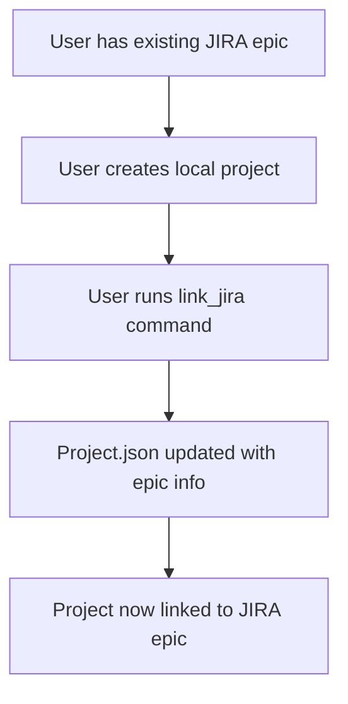

# JIRA Epic Integration Flow

## Overview

This document describes the simplified approach for linking projects to existing JIRA epics. The flow ensures users can easily connect their local projects to existing JIRA epics without any complex operations.

## Simple Flow



## Usage

### 1. Create a Project
```bash
project create --name "My Translation System"
```

### 2. Link to Existing JIRA Epic
```bash
project link_jira --projectId "translation_20250531_120000" --jiraProjectKey "TT-206"
```

That's it! The project is now linked to the existing JIRA epic.

## What Gets Stored

After linking, the project.json contains:
```json
{
  "externalTracker": {
    "type": "jira",
    "issueKey": "TT-206",
    "issueType": "epic",
    "url": "https://company.atlassian.net/browse/TT-206"
  }
}
```

## Benefits

1. **Simple**: One command to link project to epic
2. **No API Calls**: Just updates local project.json
3. **Fast**: No need to create anything in JIRA
4. **Clear**: Epic info displayed when opening project

## Future Enhancements

- Auto-fetch epic tasks when opening project
- Sync local tasks with JIRA
- Continuous mode to work through epic tasks 